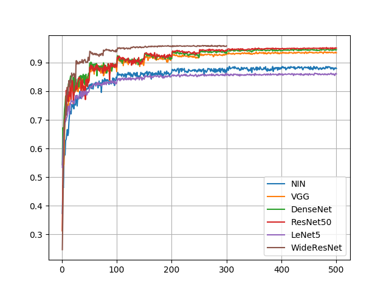

# Train various models on CIFAR10 with Chainer

## Requirements

- Python 3.5.1+ (not tested with Python2)
- pip packages:
    - chainer>=3.1.0
    - chainercv>=0.8.0
    - numpy>=1.10.1
    - matplotlib>=2.0.0
    - scikit-image>=0.13.1
    - opencv-python>=3.3.0
    - tabulate>=0.8.2

## Quick Start

```bash
MPLBACKEND=Agg python train.py
```

With full arguments:

```bash
MPLBACKEND=Agg python train.py \
--model_file models/wide_resnet.py \
--model_name WideResNet \
--batchsize 128 \
--training_epoch 300 \
--initial_lr 0.05 \
--lr_decay_rate 0.5 \
--lr_decay_epoch 25 \
--weight_decay 0.0005 \
--random_angle 15.0 \
--pca_sigma 25.5 \
--expand_ratio 1.2 \
--crop_size 28 28 \
--seed 0 \
--gpus 0 
```

## About data augmentation

It performs various data augmentation using [ChainerCV](https://github.com/chainer/chainercv). Provided operations are:

- Random roating (using OpenCV or scikit-image)
- Random lighting
- Random LR-flipping
- Random zomming (a.k.a. expansion)
- Random cropping

See the details at `transform` function in `train.py`.

## Exprimental Results

|   val/main/accuracy |   epoch | model_name   |   batchsize |   initial_lr |   lr_decay_rate |   lr_decay_epoch |   weight_decay |   random_angle |   pca_sigma |   expand_ratio | crop_size   |
|--------------------:|--------:|:-------------|------------:|-------------:|----------------:|-----------------:|---------------:|---------------:|------------:|---------------:|:------------|
|            0.958169 |     300 | WideResNet   |         128 |         0.05 |             0.5 |               25 |         0.0005 |             15 |        25.5 |            1.2 | [28, 28]    |
|            0.945708 |     300 | ResNet50     |         128 |         0.05 |             0.5 |               25 |         0.0005 |             15 |        25.5 |            1.2 | [28, 28]    |
|            0.939478 |     300 | DenseNet     |         128 |         0.05 |             0.5 |               25 |         0.0005 |             15 |        25.5 |            1.2 | [28, 28]    |
|            0.930281 |     300 | VGG          |         128 |         0.05 |             0.5 |               25 |         0.0005 |             15 |        25.5 |            1.2 | [28, 28]    |
|            0.879351 |     500 | NIN          |         128 |         0.01 |             0.5 |              100 |         0.0005 |             15 |        25.5 |            1.2 | [28, 28]    |
|            0.860166 |     500 | Cifar10      |         128 |         0.01 |             0.5 |               50 |         0.0005 |             15 |        25.5 |            1.2 | [28, 28]    |

