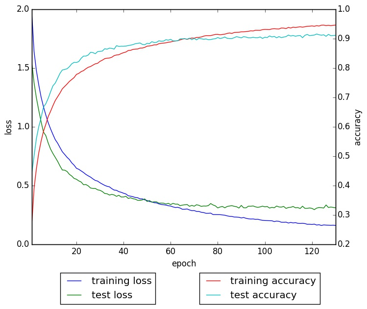

# Cifar10Net with Chainer

## Requirement

- [Chainer](http://chainer.org)
    - `$ git clone https://github.com/pfnet/chainer.git`
    - `$ cd chainer; python setup.py install`
    - `$ pip install chainer-cuda-deps`
- progressbar2
    - `$ pip install progressbar2`

## Download Cifar10 Dataset

```
$ bash download.sh
```

## Create Dataset

```
$ python dataset.py
```

## Start Training

```
$ python train.py
```

See the help messages with --help option for details.

You can choose model file to be trained from models dir. Cifar10, Network In Network (NIN), and VGG-net (with some variants) are already prepared. The architecture of VGG_mini is derived from [here](https://github.com/nagadomi/kaggle-cifar10-torch7). The original paper of VGG-net is found in [here](http://arxiv.org/pdf/1409.1556.pdf).

## Models

- There are four types of base architectures
    - Cifar10
    - NIN (Network In Network)
    - VGG (similar to original VGG-net)
    - VGG_mini (same as [nagadomi](https://github.com/nagadomi/kaggle-cifar10-torch7)'s model)
- Variants are different at Batch Normalization and Parameterized ReLU
    - BN: Batch Normalization for first two blocks of convolutional layer
    - ABN: Batch Normalization for all convolutional layers
    - PReLU: Parameterized ReLU for all activation functions

- VGG_mini_PReLU didn't perform well
- Default setting (`$ python train.py`) is VGG_mini_ABN, and it performed the below result (91.09% accuracy at epoch 100):



I don't know why but `chainer.functions.accuracy` function returns a little better value. So I tested experimental results with `test.py`.

## Test

```
$ python test.py --eval normal \
--model results/VGG_mini_ABN/VGG_mini_ABN.py \
--param results/VGG_mini_ABN/VGG_mini_ABN_Adam_epoch_100.chainermodel \
--norm 0 --batchsize 128 --gpu 0
```

## Draw Loss Curve

```
$ python draw_loss.py --logfile log.txt --outfile log.jpg
```

### TIPS:

- The label vector will be passed to softmax_cross_entropy should be in shape (N,). (N, 1) causes divergence of weights.
- If `model.to_cpu()` and `model.to_gpu()` are called during training, test scores are fixed and never updated.
